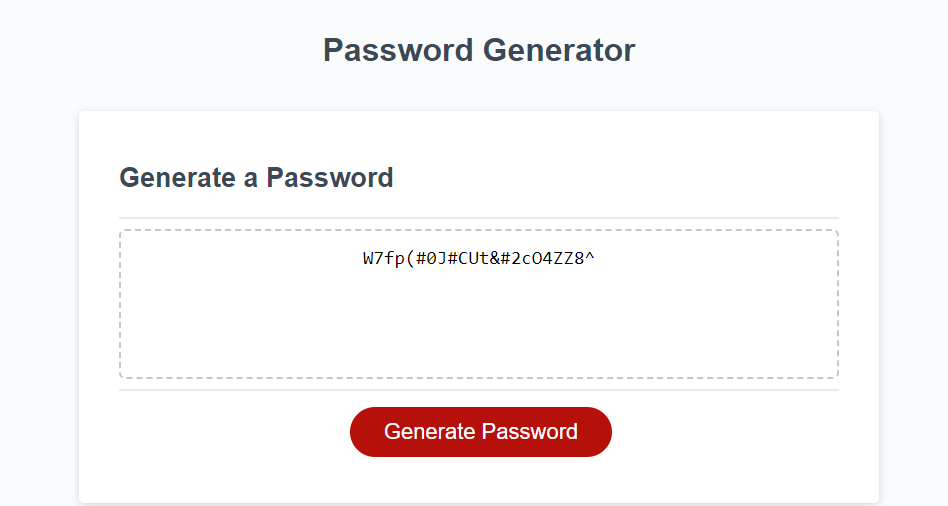

# Random Password Generator

A starting webpage was provided and styled, with the goal being to create a random password generator.
 This functions primarily by utilizing JavaScript.
 When the "Generate Password" button is clicked, a series of prompts will appear.
 These will determine password length as well as which types of characters will be used in the password.
 Once all prompts have been answered, the new password will appear inside the dotted box.

[A link to the original repository can be found here.](https://github.com/coding-boot-camp/friendly-parakeet)

[A link to the new website with the working password generator can be found here.](https://anthonyrqqq.github.io/random-password-generator)

### Sources

- Final "for loop" code in password generation constructed with assistance from Tom Woods (script.js lines 49-51).